# crud-person

crud-person is a minimum features that can insert, update, read, delete person information. Moreover, it includes to get a user's location when inserting a person data, but user needs to allow google chrome to access a device's location. This repository has 3 applications with different frameworks to support the requirements

## Flutter

Flutter is a google tool helping developer to create application that can be cross-platform.

#### Application flow

- Insert person

user clicks the added button to show a popup to fill in the form to create person.

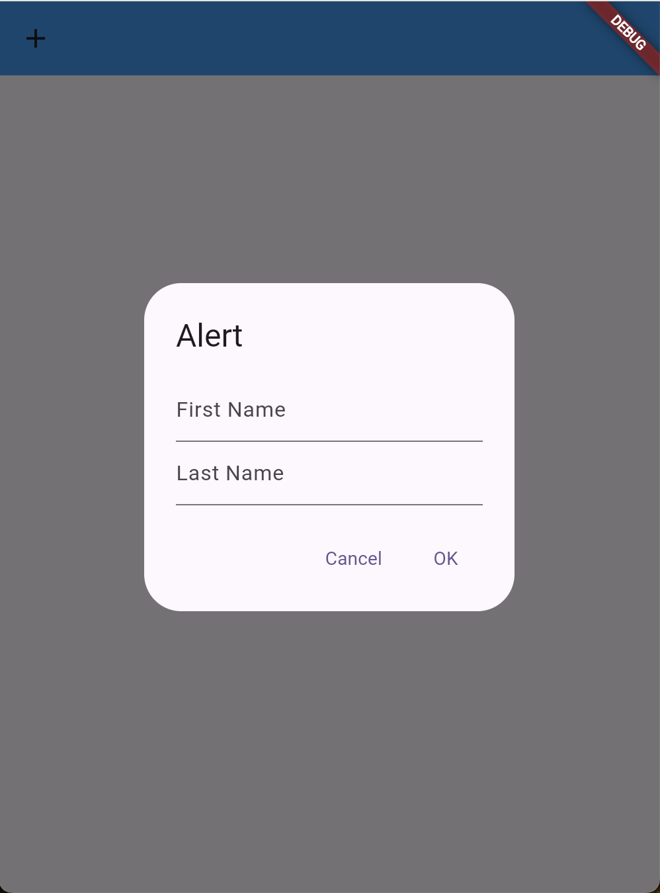

- Read people

- Read many people

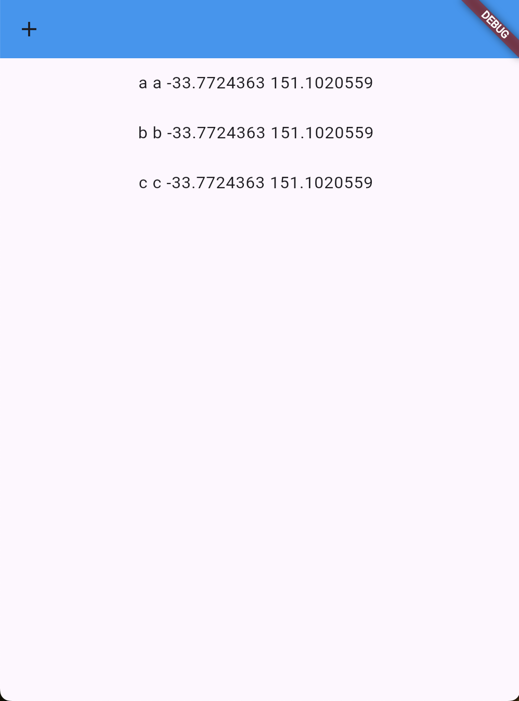

- Update people

user clicks on the person's row twice a time to show popup for updating

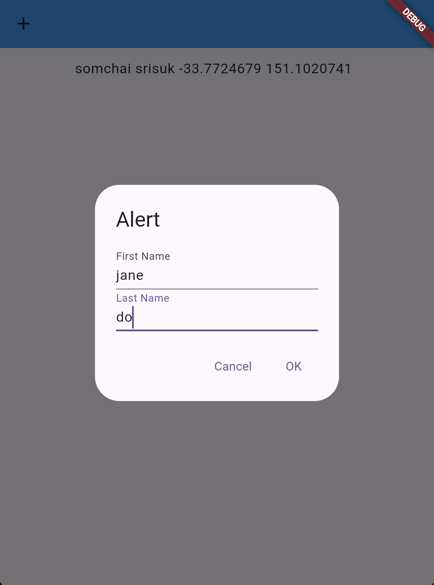

- Delete people

user clicks and holds a row until the person is deleted

## Bubble.io

Bubble.io is a no-code platform that allows users to build web applications without needing to write code.

### Application flow

- Insert person

user types first name and last name then clicks the enter button to insert person.

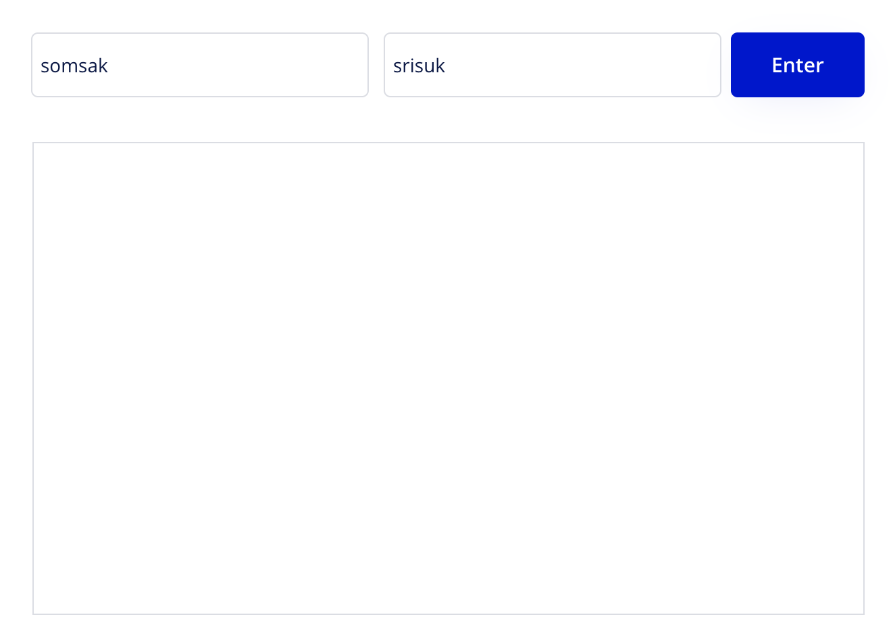

- Read people

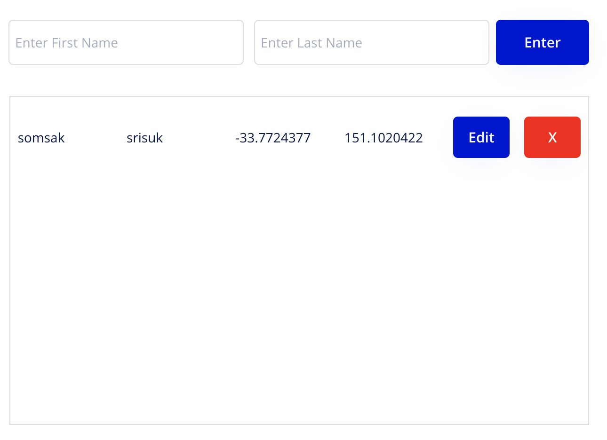

- Read many people

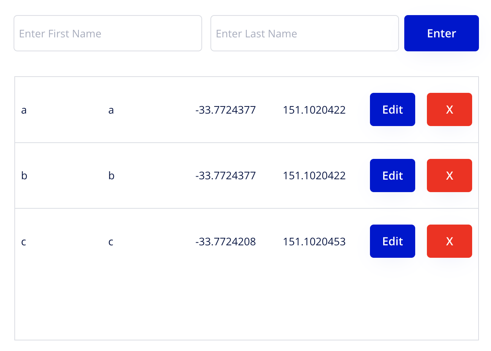

- Update people

user clicks the edit button to show popup for updating

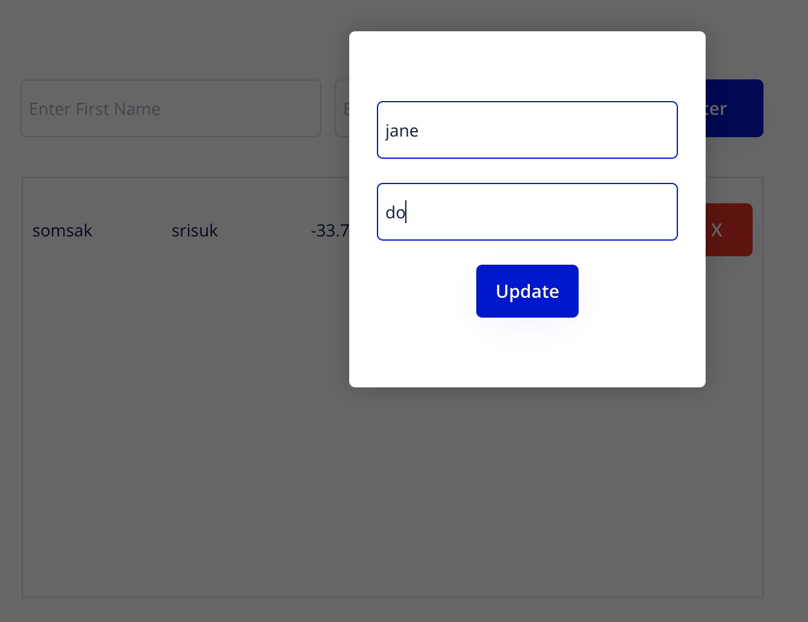

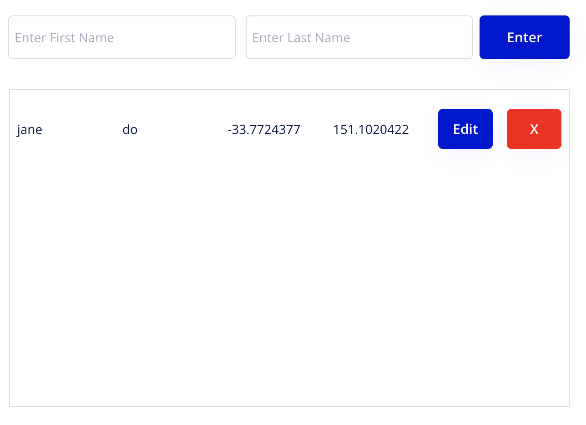

- Delete people

user clicks a red button to delete a person.

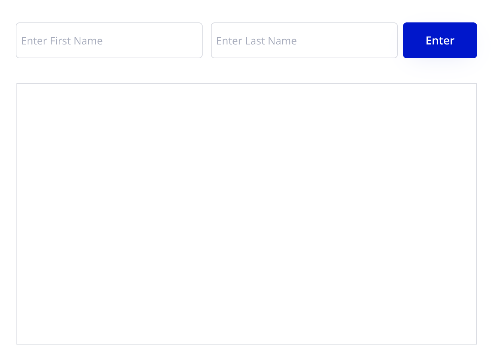

## Devexpress ( React )

DevExtreme React by DevExpress is a comprehensive UI component library designed for building high-performance web applications with React

### Application flow

- Insert person

user clicks the added button to show a popup to fill in the form to create person.

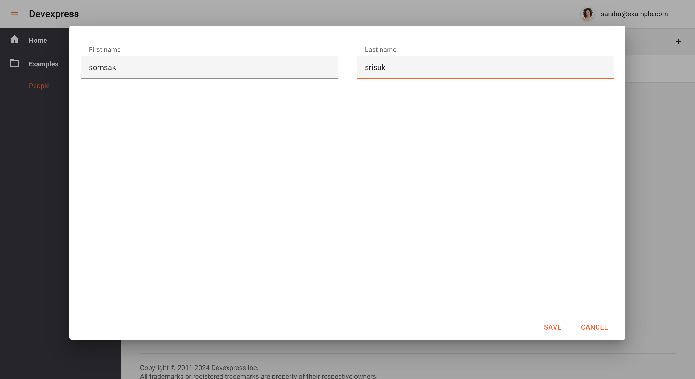

- Read people

- Read many people

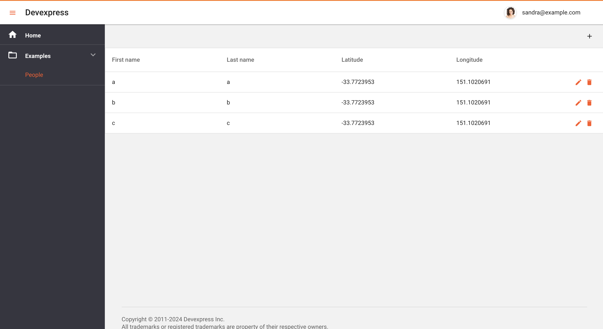

- Update people

user clicks the edit button to show popup for updating

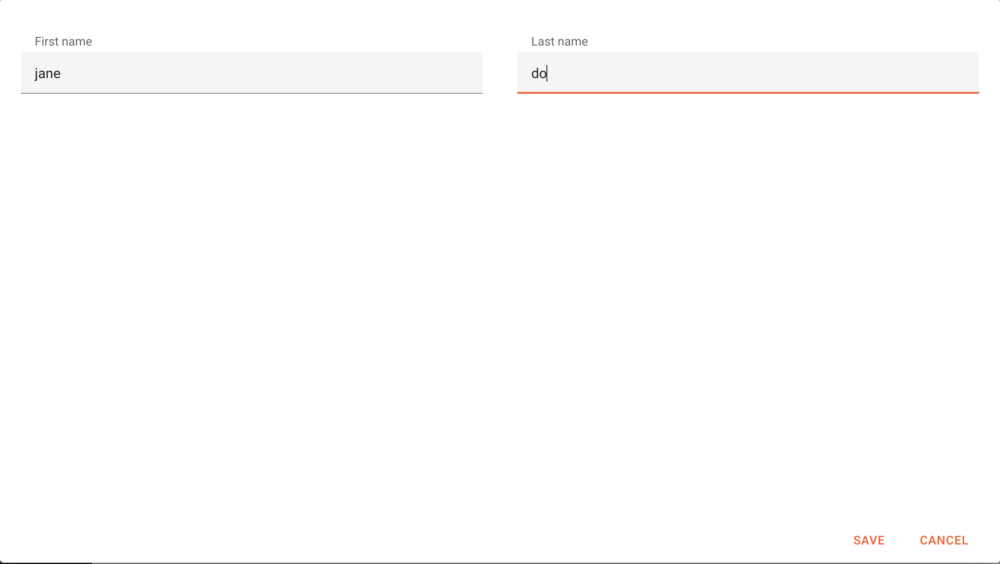

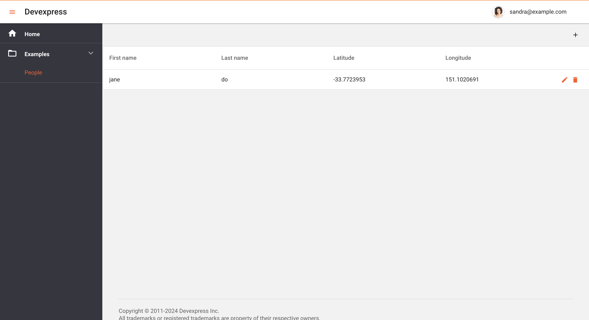

- Delete people

user clicks a red button to delete a person.

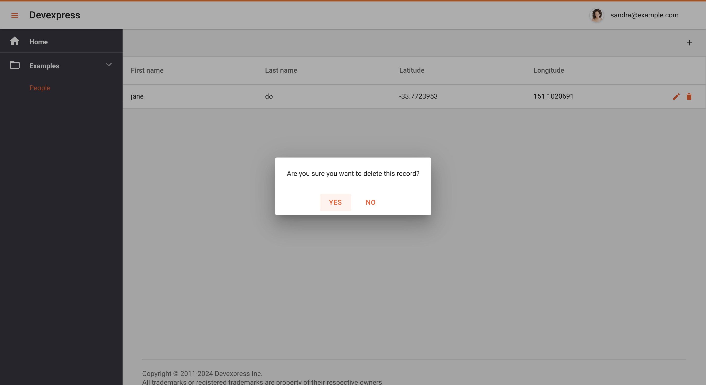

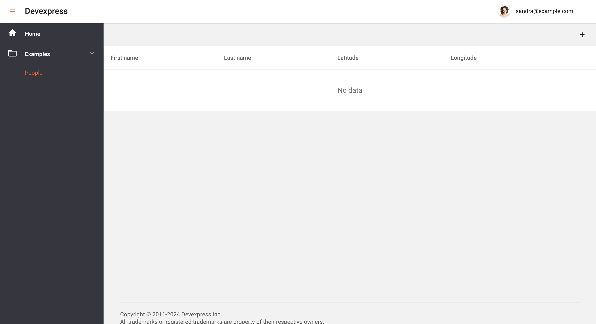
